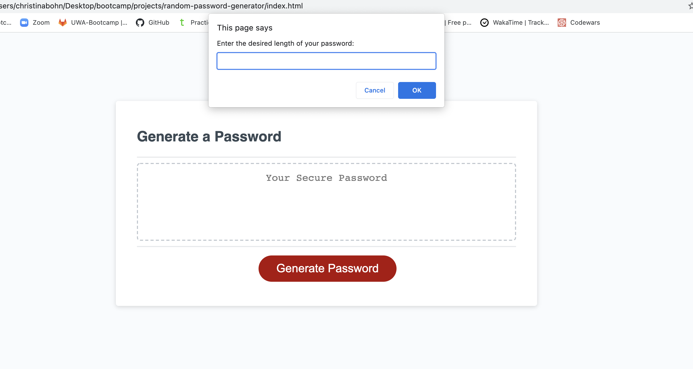

# random-password-generator
## In this project, I am creating a Javascript-powered password generator.
This application runs in the browser, dynamically updating the HTML and CSS to allow the user to generate a password. The string of characters that is created will be a user-selected length between 8 and 128 characters and will include numbers, symbols, uppercase and/or lowercase letters, all entered via prompts.

## What I learned
This project was a great first dive into Javascript, exploring variables, arrays, conditional statements, functions, and fitting them all together into a functional application.

This provided good practice in troubleshooting errors - learning to isolate different parts of the code to see where things might be breaking down. Google is, of course, a great resource! I learned a lot while looking up what Javascript is able to do and what methods are available to accomplish different tasks.

And of course, there are so many different angles to attack any project from. Whenever I came up against a piece of the password generator I didn't know how to code, my next step was always to break it down into smaller pieces and then to reach out for help where it was needed.

## Links
https://christinabohn.github.io/random-password-generator/

https://github.com/ChristinaBohn/random-password-generator

## Site Preview

